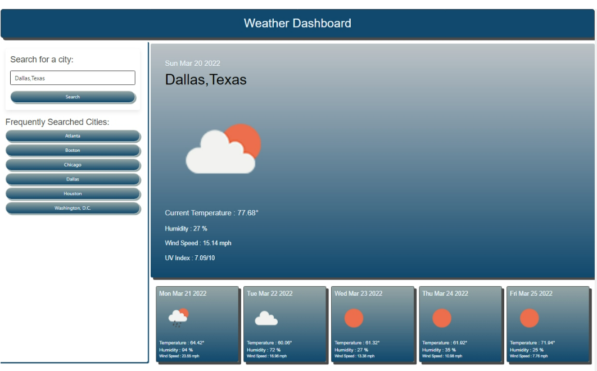

# Weather Dashboard

## Module 6 Challenge

### Purpose

This is a 5-day weather forecast application. It retrieves data from [OpenWeather One Call API](https://openweathermap.org/api/one-call-api) to provide the user with dynamically updated weather conditions.  

The user is able to use the application to search for current and future weather in their desired city. The search may be performed by either typing the name of the city in the search box or by chosing from a list of popular travel destinations. 

The user is presented with the city name, the current and future dates, the current UV index, as well as an icon representation of the weather conditions, temperature, and wind speed for each day.

### Built With 

- HTML
- CSS
- JavaScript

### Website
* The URL of the GitHub repository. Give the repository a unique name and include a high-quality README describing the project.

